# Predictive Alignment: Continual Learning without Catastrophic Forgetting

Reproduction and extension of [Asabuki & Clopath (2025)](https://doi.org/10.1038/s41467-025-61309-9) — a biologically-plausible learning rule where a fixed random scaffold (G) plus a local Hebbian rule (M) enables networks to learn multiple dynamical systems sequentially with zero catastrophic forgetting.

## Key Finding

Predictive alignment's forgetting resistance is a **structural property** of the G/M + per-task readout architecture. It does not depend on Q orthogonality, task diversity, task order, or network scale (above a threshold of N~500 neurons). The fixed G scaffold is the essential ingredient — it provides stable dynamics and a reference for the M learning rule. Across 12 ablation experiments, we found **zero forgetting** in the vast majority of conditions, and the network can hold **50+ tasks** simultaneously.

## Results Summary

| Exp | Question | Answer |
|-----|----------|--------|
| 3.5 | N scaling? | Threshold at N~500; forgetting vanishes above it |
| 3.6 | Capacity limit? | >50 tasks at N=500 with no systematic forgetting |
| 3.7 | Is G necessary? | Yes — G=0 prevents learning entirely |
| 3.8 | Is Q orthogonality key? | No — shared Q still shows zero forgetting |
| 3.9 | BPTT comparison? | BPTT barely learns with same budget; PA is more sample-efficient |
| 3.10 | Similar tasks? | No forgetting even with 10ms period spacing |
| 3.11 | Order dependence? | 75% of orders show zero forgetting; simple-to-complex is best |
| 3.12 | Simultaneous vs sequential? | Sequential is best; no cost since forgetting is zero |

## Key Figures

### Sine wave autonomous generation (Exp 01)
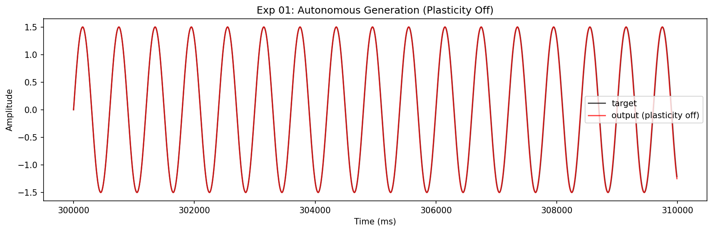

### Learning rate (alpha) sweep (Exp 02)
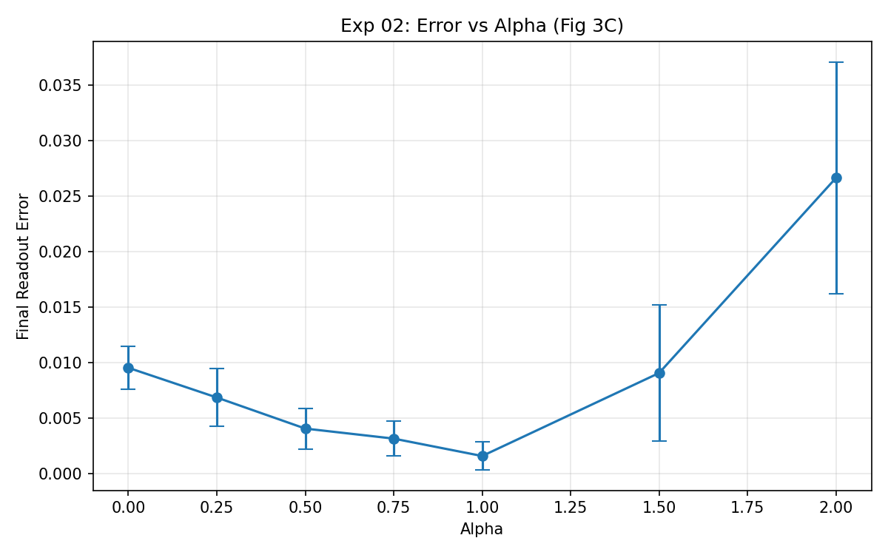

### Lorenz attractor tracking (Exp 05)
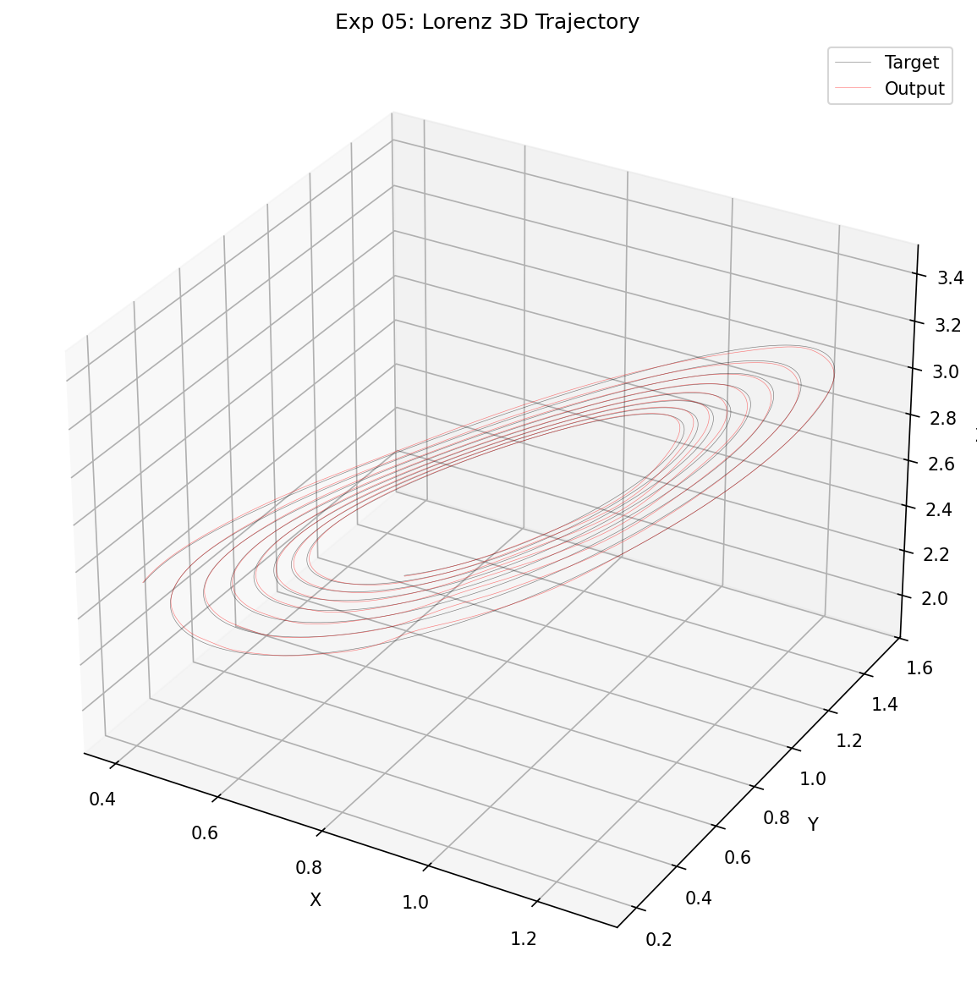

### Forgetting matrix — 4 systems sequential (Exp 3.4)
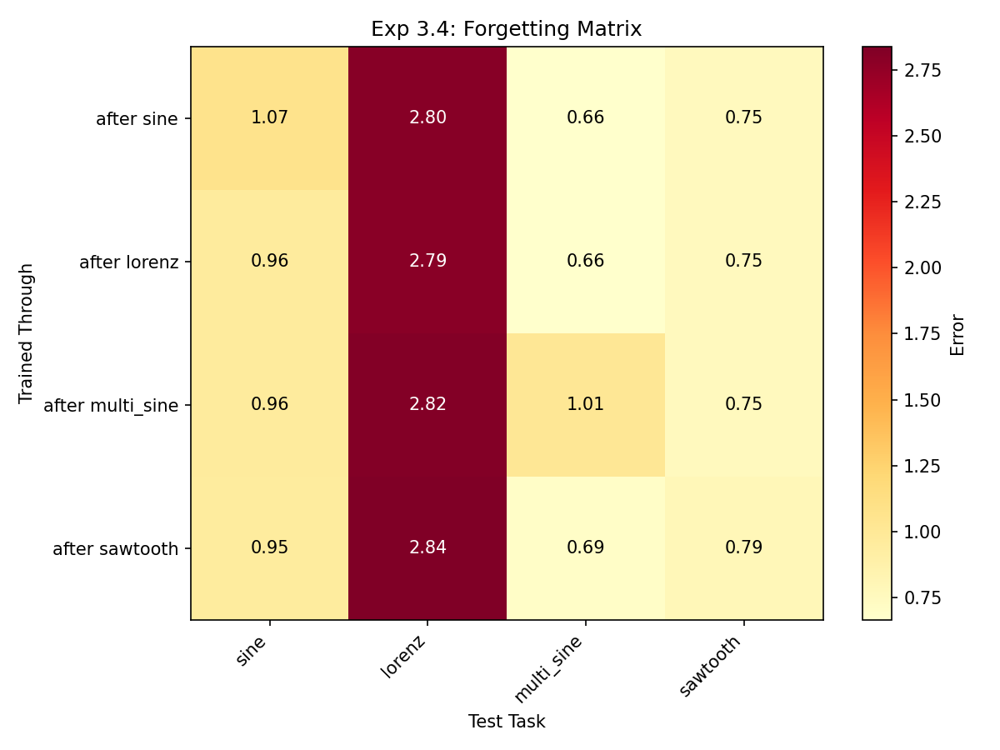

### N scaling threshold (Exp 3.5)
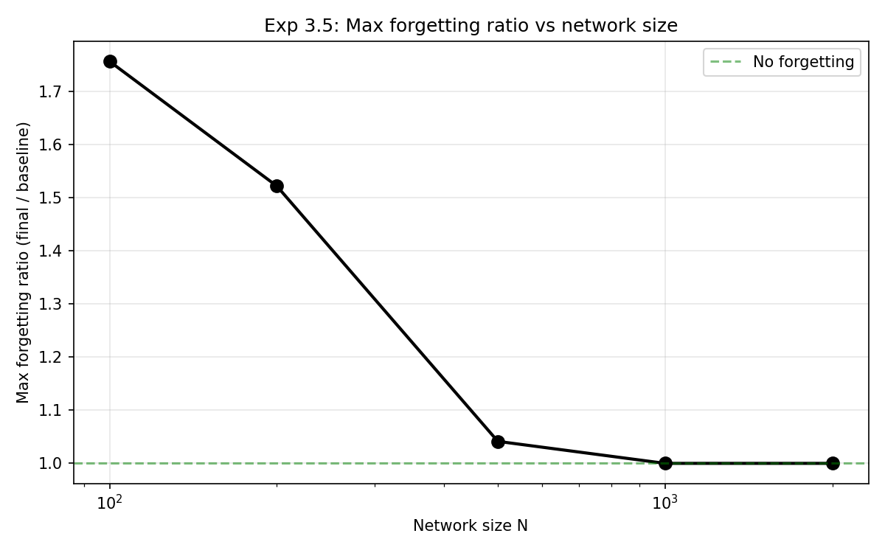

### Capacity curve — 50+ tasks (Exp 3.6)
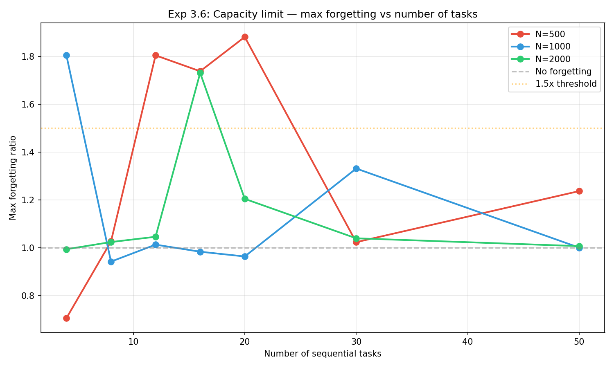

### G ablation — scaffold is essential (Exp 3.7)
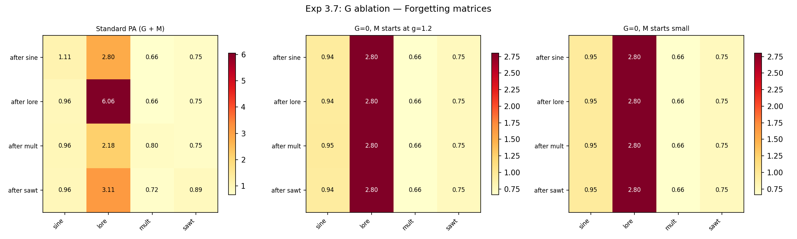

### Q ablation — orthogonality not required (Exp 3.8)
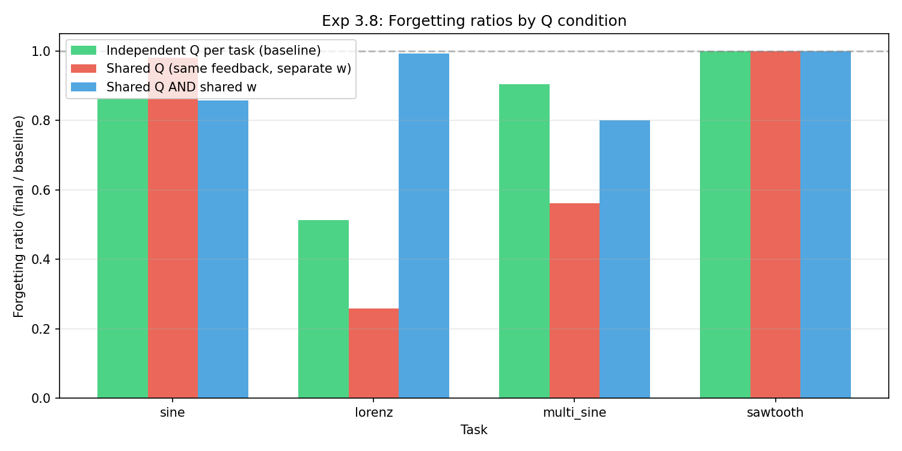

### BPTT comparison (Exp 3.9)
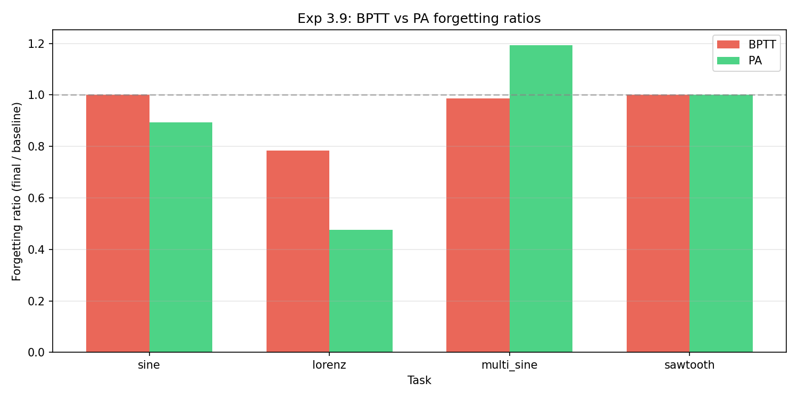

### Task similarity (Exp 3.10)
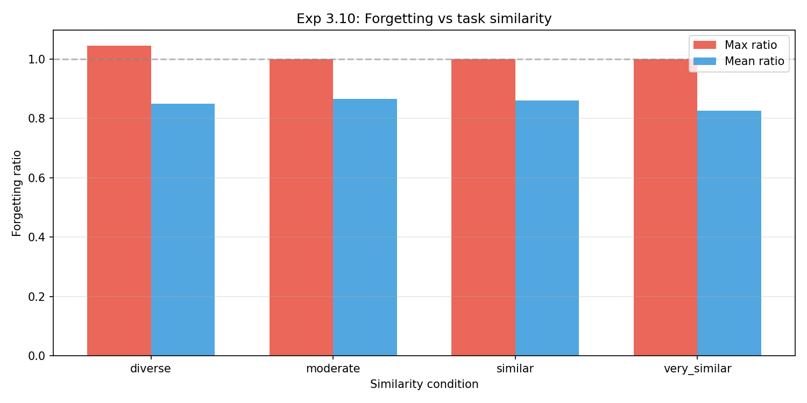

### Task order permutations (Exp 3.11)
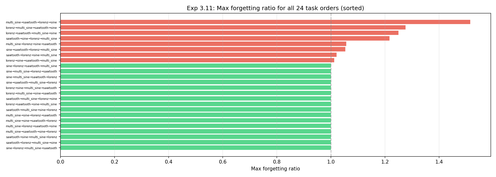

### Simultaneous vs sequential training (Exp 3.12)
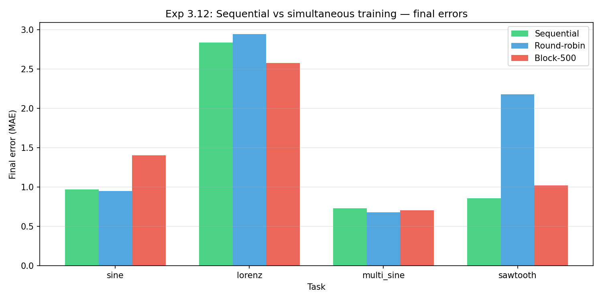

## Project Structure

```
predictive_alignment/
├── src/
│   ├── network.py          # Core PA network (G, M, readout w)
│   ├── targets.py           # Target signal generators
│   ├── instrumentation.py   # Logging and metrics
│   └── utils.py             # Shared utilities
├── experiments/
│   ├── 01_sine_wave.py      # Single sine wave validation
│   ├── 02_break_alpha.py    # Learning rate sweep
│   ├── 03_edge_of_chaos.py  # Lyapunov exponent analysis
│   ├── 04_eigenspectrum.py  # Eigenvalue analysis
│   ├── 05_lorenz.py         # Lorenz attractor (3D chaos)
│   ├── 06_rsg_timing.py     # Ready-Set-Go timing task
│   ├── 07_*.py              # Pendulum / generalization variants
│   ├── exp2_*.py            # Phase 2: BPTT, HNN, neural ODE comparisons
│   └── exp3_*.py            # Phase 3: Continual learning ablations
├── results/figures/          # Curated publication figures
├── RESEARCH_LOG.md           # Full experimental narrative
├── requirements.txt
└── README.md
```

## How to Reproduce

```bash
pip install -r requirements.txt

# Run any experiment from repo root:
python experiments/01_sine_wave.py
python experiments/exp3_6_capacity_limit.py

# Results are saved to results/<experiment_name>/
```

Each script is self-contained — it creates its results directory, runs training, and saves plots + metrics.

## Experiment Index

| Script | Description |
|--------|-------------|
| `01_sine_wave.py` | Single sine wave — validates core PA implementation |
| `02_break_alpha.py` | Sweep learning rate alpha to find stability boundary |
| `03_edge_of_chaos.py` | Lyapunov exponent analysis of network dynamics |
| `04_eigenspectrum.py` | Eigenvalue spectrum of G, M, and G+M |
| `05_lorenz.py` | Lorenz attractor — 3D chaotic system tracking |
| `06_rsg_timing.py` | Ready-Set-Go interval timing task (deferred — code available) |
| `07_pendulum.py` | Damped pendulum system |
| `07_pendulum_ablations.py` | Pendulum with parameter ablations |
| `07_generalization_test.py` | Generalization to unseen initial conditions |
| `07e_multiIC_generalization.py` | Multi-IC training for generalization |
| `exp2_0_bptt_baseline.py` | BPTT baseline for comparison |
| `exp2_1_scheduled_sampling.py` | Scheduled sampling curriculum |
| `exp2_3_lotka_volterra.py` | Lotka-Volterra predator-prey dynamics |
| `exp2_3b_hnn_lotka_volterra.py` | Hamiltonian Neural Network on L-V |
| `exp2_3c_hnn_trajectory.py` | HNN trajectory analysis |
| `exp2_4_double_pendulum.py` | Double pendulum (chaotic) |
| `exp2_5_neural_ode.py` | Neural ODE comparison |
| `exp3_1_continual_learning.py` | Two-system sequential learning + forgetting curve |
| `exp3_3_alpha_sweep.py` | Alpha sweep in continual learning context |
| `exp3_4_four_system.py` | Four systems sequential — forgetting matrix |
| `exp3_5_N_scaling.py` | Network size scaling — forgetting threshold |
| `exp3_6_capacity_limit.py` | Capacity limit — how many tasks before forgetting? |
| `exp3_7_G_ablation.py` | G scaffold ablation — is it necessary? |
| `exp3_8_Q_ablation.py` | Q orthogonality ablation |
| `exp3_9_bptt_forgetting.py` | BPTT forgetting comparison |
| `exp3_10_task_similarity.py` | Task similarity — do similar tasks cause forgetting? |
| `exp3_11_task_order.py` | Task order permutation study |
| `exp3_12_simultaneous.py` | Simultaneous vs sequential training |

## Note on Exp 06 (RSG)

The Ready-Set-Go timing task (Exp 06) requires interval-dependent output modulation that doesn't map cleanly to the current readout architecture. The code is available but results are deferred.

## Citation

Based on:
> Asabuki, T. & Clopath, C. (2025). Predictive alignment of network activity for learning and memory consolidation. *Nature Communications*, 16, 5014.
> https://doi.org/10.1038/s41467-025-61309-9
